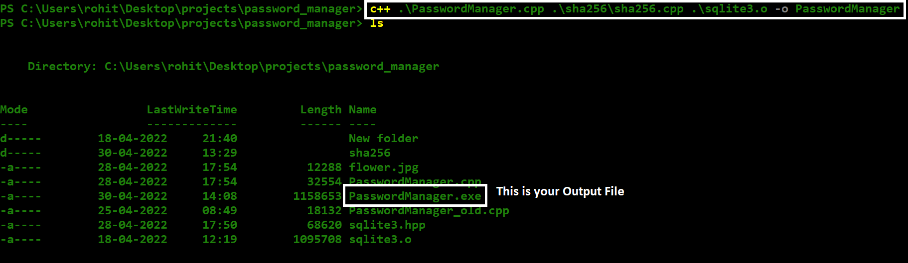
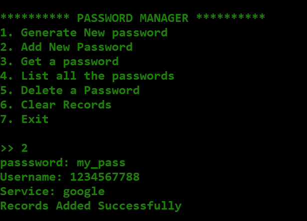
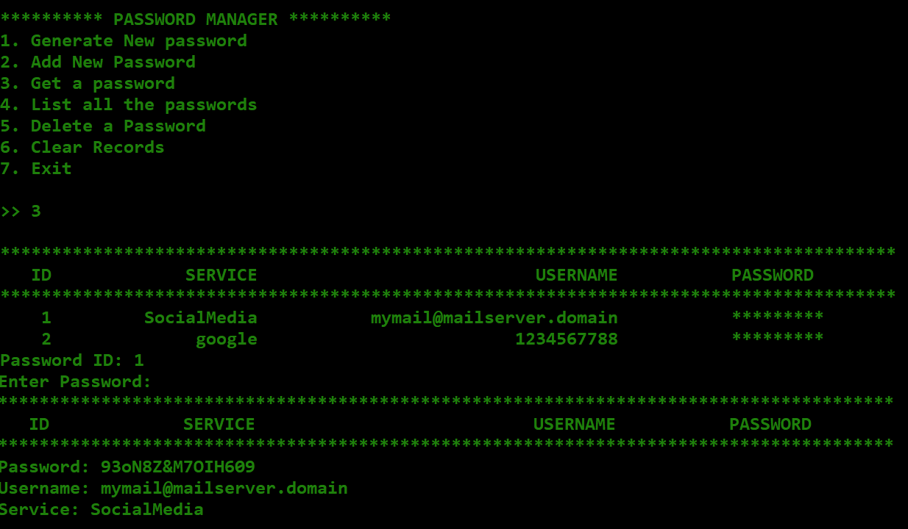
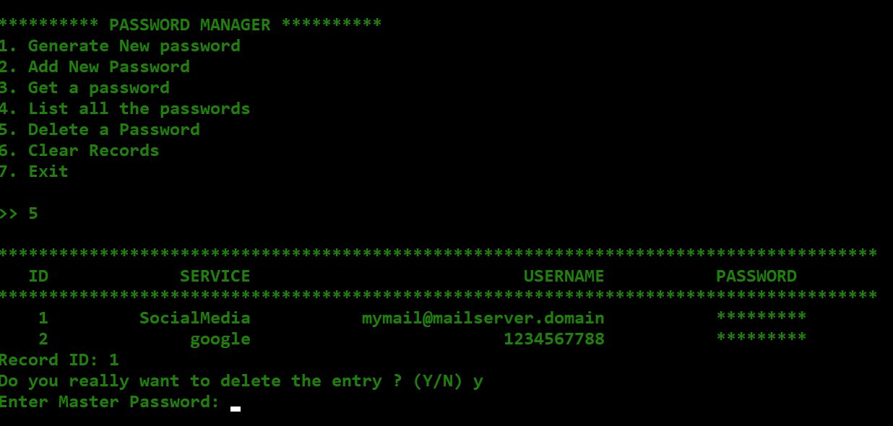
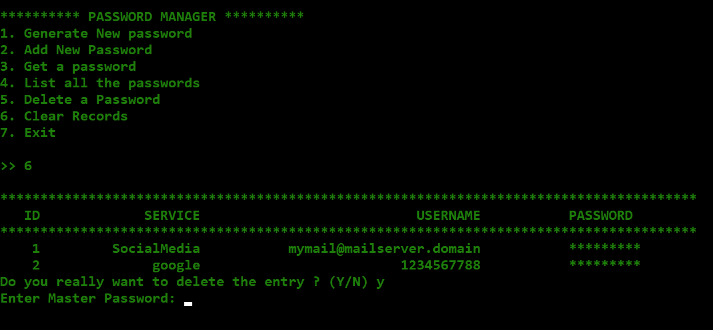

# PasswordManager
A Command Line Password Manager Utility written in c++ with sqlite3 database

Master password and PRIVATE_KEY
<pre>
Master Password: password
PRIVATE_KEY: (you can enter anything for the fist time, but have to remember that, coz you have to use  the same key everytime, otherwise your password will not be decrypted.
</pre>

Step 1: Get the source code
<pre>
 git clone https://github.com/rohitkrtiwari/PasswordManager.git
</pre>

Step 2: Compile the program
<pre>
 c++ .\PasswordManager.cpp .\sha256\sha256.cpp .\sqlite3.o -o PasswordManager.exe  
</pre>

Step 3: Run the executable
<pre>
 ./PasswordManager.exe
</pre>

  
<code>
**flower.jpg is the file where your passwords are stored, keep it safe and secure.**
</code>

  

## Generate Password : >> 1

  

## Add New Password : >> 2

  

## Fetch a Saved Password : >> 3

  

## List all Records : >> 4

  

## Delete a Password : >> 5

  

## Clear all Passwords : >> 6

